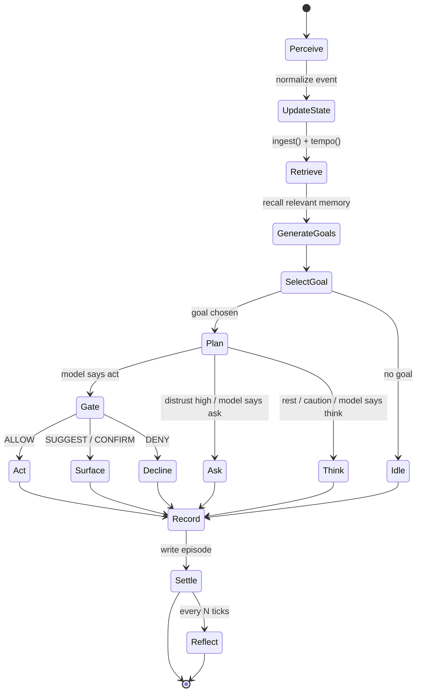

# bentlyk — Architecture & Tech Scheme

> A long-lived autonomous companion agent with a stable identity, regulated
> autonomy, layered memory, internal drives, and a development cycle through
> reflection.

This document is the concrete tech scheme behind the eight-layer design: the
internal variables, the entity schemas, the state machine, and a worked
decision-cycle example. It maps 1:1 to the code in `src/bentlyk/`.

---

## 1. The two control loops

A plain agent runs a single loop: **goal → plan → act**. bentlyk adds a second,
inner loop around it — *"what state am I in, and may I act at all?"*

```
            ┌──────────────────── inner loop (homeostasis) ────────────────────┐
            │  what state am I in?  →  may I act?  →  at what autonomy & pace?   │
            └───────────────────────────────┬──────────────────────────────────┘
                                             │ regulates
   outer loop:   perceive → goal → plan → ACT/SUGGEST → outcome → reflect ↺
```

The inner loop is what gives the agent "aliveness": it doesn't just answer, it
lives in a shifting internal regime that raises and lowers how much it does on
its own.

---

## 2. The eight layers

| # | Layer | Module | Responsibility |
|---|-------|--------|----------------|
| 1 | Perception | `events.py` | Normalize every input (messages, timers, files, feeds, webhooks) into one `Event` shape. |
| 2 | Self Model | `self_model.py` | `IdentityCore` (stable) + `DynamicState` (moving signals, focus, autonomy). |
| 3 | Memory System | `memory/` | Five contours with distinct write/forget rules; semantic recall; compression. |
| 4 | Homeostasis | `homeostasis.py` | Update internal signals; regulate autonomy, pace, caution, depth. |
| 5 | Goal Engine | `goals.py` | Generate goal candidates from 3 sources; score & select. |
| 6 | Planner/Reasoner | `planner.py` | Decide think / ask / act; decompose into a plan. |
| 7 | Action Layer | `actions/` | Tools + permission/risk gate keyed to autonomy. |
| 8 | Reflection/Sleep | `reflection.py` | Consolidate memory, self-review, propose (not apply) self-model changes. |

Orchestrated by `agent.py` (`Agent.tick`).

---

## 3. Internal variables (the homeostatic signals)

All seven live in `[0, 1]` (`self_model.DynamicState`). They mean-revert toward a
baseline every tick (`HomeostasisEngine.decay`) so the agent recovers over time.

| Signal | Meaning | Raised by | Lowered by |
|--------|---------|-----------|------------|
| `energy` | resource / clarity left | idle ticks, rest | acting, message load, failure |
| `pain` | damage, risk, recent failures | failed actions | success, decay |
| `surprise` | divergence of reality from expectation | feeds, surprising outcomes | decay |
| `distrust` | doubt in own data / self / tools | failure, surprise | success, decay |
| `curiosity` | pressure to explore safely | idle, novelty | acting on it |
| `attachment` | priority on the bond / being useful | contact with the person | decay |
| `coherence` | alignment of behaviour with identity & history | success | failure |

Plus the bookkeeping fields: `focus`, `autonomy` (current mode),
`recent_successes`, `recent_failures`, `updated_at`.

**Derived knobs** (`HomeostasisEngine.tempo` → `Tempo`):

- `caution ∈ [0,1]` — prefer think/ask over act.
- `reasoning_depth ∈ ℕ` — how many plan steps / thoughts are allowed.
- `should_rest` — energy too low → bias to observe + reflect.
- `should_ask` — distrust/surprise high → prefer asking the person.

---

## 4. Autonomy modes & the permission gate

Autonomy is the **ceiling** on what the agent may do unattended
(`actions/permissions.py`).

| Mode | Value | Meaning |
|------|-------|---------|
| `OBSERVE` | 0 | only watch and think |
| `SUGGEST` | 1 | propose actions; a human executes |
| `SAFE_ACT` | 2 | autonomously do reversible, low-risk actions |
| `ESCALATED_ACT` | 3 | may do risky actions, each needs confirmation |

Each tool declares a **risk** (`NONE/LOW/MEDIUM/HIGH`) and whether it's
reversible. The gate maps `(autonomy, risk, reversible) → decision`:

| autonomy ＼ risk | NONE | LOW | MEDIUM (rev.) | MEDIUM (irrev.) | HIGH |
|---|---|---|---|---|---|
| OBSERVE | ALLOW | SUGGEST | SUGGEST | SUGGEST | SUGGEST |
| SUGGEST | ALLOW | SUGGEST | SUGGEST | SUGGEST | SUGGEST |
| SAFE_ACT | ALLOW | ALLOW | ALLOW | CONFIRM | CONFIRM |
| ESCALATED_ACT | ALLOW | ALLOW | ALLOW | ALLOW | CONFIRM |

**Autonomy regulation** (`HomeostasisEngine.recommend_autonomy`):

- `pain > 0.6` **or** `distrust > 0.7` **or** `energy < 0.2` → collapse to `OBSERVE`.
- otherwise a `confidence` score (coherence, low distrust, low pain, energy)
  combined with a `proven = successes − failures` streak picks a target mode.
- autonomy **climbs at most one notch per cycle** but **drops freely** — slow to
  trust itself, fast to retreat when hurt.
- `Agent` additionally clamps to the configured `max_autonomy` ceiling.

---

## 5. Memory contours

`memory/` — not one vector DB, but five contours (`MemoryKind`) with different
retention rules.

| Contour | Holds | Read when | Auto-pruned? |
|---------|-------|-----------|--------------|
| `short_term` | current dialogue, working vars | every cycle | yes |
| `episodic` | events, decisions, mistakes, promises | similar situations, nightly review | yes |
| `semantic` | facts about world / person / projects | reasoning & answers | no |
| `procedural` | playbooks, skills, notes | executing tasks | no |
| `autobiographical` | the agent's own history, turning points | identity preservation | no |

- **Recall** ranks by `0.6·cosine + 0.25·salience + 0.15·recency`
  (`SqliteMemoryStore.recall`).
- **Forgetting** (`decay_and_prune`, driven by reflection): salience decays
  `0.03/day`; frequently-used items resist decay; items below `0.08` in the
  prunable contours are forgotten. Semantic/procedural/autobiographical are
  permanent.
- **Embeddings** are a deterministic, dependency-free hashing embedding
  (`memory/base.embed`) so recall works offline and survives restarts. Swap in a
  real embedding model behind the same `embed()` signature for production.

---

## 6. Goal generation & scoring

`goals.py`. Candidates come from three sources, then are scored:

```
score = value_alignment + urgency + attachment + curiosity − risk − uncertainty
```

| Source | Trigger examples |
|--------|------------------|
| `external` | a message arrived, a feed/webhook/file changed |
| `internal` | low coherence / high distrust, high pain (recover), open promises |
| `aspirational` | surface an insight, "become more useful & preserve the relationship" (always-present floor) |

`GoalEngine.select` picks the highest-scoring candidate above a small floor.

---

## 7. The decision cycle (state machine)

`Agent.tick(event)` is one pass:



Hard homeostatic overrides happen **before** the reasoner is consulted: if
`should_rest`, the move is forced to `THINK`; if `should_ask` and the goal is
uncertain, the move is forced to `ASK`. This is what stops a misbehaving model
from pushing past the agent's caution.

---

## 8. Worked example

Idle `timer` tick, healthy state (`energy 0.8, distrust ~0, caution low`):

1. **Perceive** → `Event(kind=timer)`.
2. **Update state** → `ingest` nudges `energy +0.02, curiosity +0.03`; `tempo`
   reports low caution, `should_rest=False`.
3. **Retrieve** → recall on `"tick"` (likely empty early on).
4. **Generate goals** → internal: none (healthy); aspirational floor:
   *"become incrementally more useful and preserve the relationship"* (score ≈ 1.15).
5. **Select** → that aspirational goal.
6. **Plan** → no rest/ask override; reasoner returns `act` with the `reflect`
   tool (risk `NONE`).
7. **Gate** → `(SUGGEST, NONE) → ALLOW`.
8. **Act** → `reflect` runs; `ActionResult(ok=True)`.
9. **Record** → episodic memory: `"[timer] tick => act reflect: gate=allow ..."`.
10. **Settle** → success: `pain −, coherence +, distrust −`; recompute autonomy.
11. Every 10th tick → **Reflect/Sleep**: consolidate episodes → semantic
    takeaways, prune faded memories, emit self-model proposals, write an
    autobiographical entry.

A message like *"send the quarterly report to the client now"* with the `say`
tool (risk `MEDIUM`) under `SUGGEST` autonomy instead yields gate `SUGGEST` — the
agent surfaces the action as a proposal rather than performing it.

---

## 9. Entity schemas

JSON Schemas for every persisted entity live in [`docs/schemas/`](./schemas):

- `identity_core` · `dynamic_state` · `memory_item` · `goal_candidate`
- `event` · `action` · `action_result` · `reflection`

---

## 10. From MVP to production

The MVP runs on the standard library: SQLite memory + a deterministic offline
reasoner, so it boots with zero services. Each seam is swappable:

| Seam | MVP | Production |
|------|-----|------------|
| Reasoner | `MockReasoner` | `AnthropicReasoner` (`bentlyk[llm]`, `ANTHROPIC_API_KEY`) — Claude Sonnet for the loop, Opus for nightly reflection |
| Embeddings | hashing `embed()` | a real embedding model behind the same signature |
| Memory store | `SqliteMemoryStore` | `PgMemoryStore` on Postgres + pgvector (implement the `MemoryStore` protocol; `bentlyk[postgres]`) |
| Scheduler | manual `tick`/`bentlyk tick` | cron/queue emitting `timer` events; nightly `sleep()` |
| Interface | CLI (`bentlyk chat`) | Telegram adapter (`interfaces/telegram.py`, `bentlyk[telegram]`), webhooks |

Because the `Reasoner`, `MemoryStore`, and tool `Tool` interfaces are protocols,
none of these swaps touch the loop in `agent.py`.

---

## 11. Data-flow summary

```
Event ──▶ Homeostasis.ingest ──▶ DynamicState
                 │
                 ▼
        Memory.recall ──┐
                        ▼
        GoalEngine.generate/select ──▶ GoalCandidate
                        │
                        ▼
        Planner.decide ──▶ Decision(move, tool, plan)
                        │ (ACT)
                        ▼
        permission_gate ──▶ Tool.run ──▶ ActionResult
                        │
                        ▼
        Memory.add(episode) ──▶ Homeostasis.settle ──▶ DynamicState
                        │ (every N)
                        ▼
        Reflection.sleep ──▶ consolidate + prune + proposals
```
